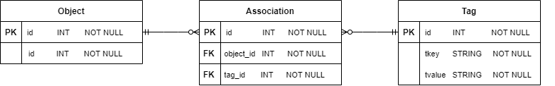
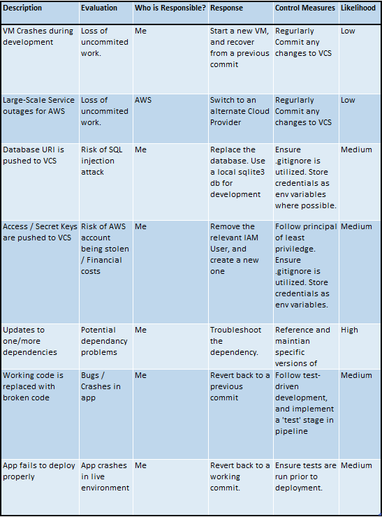

# flask-tagdb
Author: Daniel Brownless
## Project Scope.
A small flask-based object-tagging system.

This is a side-project to practice web-development and deployment techniques.

## Installation / Configuration

## Data Design

## Unit testing

## Project Tracking
Screenshot / link to kanban board.
https://trello.com/b/d23rQqxy/flask-tagdb

## Risk Assessment
My initial risk assessment
  

## References